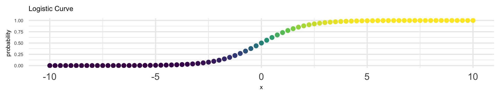

```{r setup, include=FALSE}

knitr::opts_chunk$set(echo = FALSE,
                      fig.margin = TRUE)

library(ggplot2)

library(dplyr) # data wrangling

library(DT) # nice data table

library(tibble) # tibbles

```


```{r, layout="l-screen"}

knitr::include_graphics("images/forest.png")

```

# About Me

* A little bit about [my background](./background.html)
* My [CV](https://ssw.umich.edu/sites/default/files/documents/faculty/cvs/agrogan_cv.pdf)

# "Blog-ish" Posts 

* [posts](https://agrogan1.github.io/myposts/)

```{r}

load("./myposts/myHTMLfiles.RData") # get data on blog-ish posts

myHTMLfiles %>% 
  rownames_to_column(var = "filename") %>% # rownames to column
  filter(filename != "blogtest.html") %>%
  filter(filename != "blogtest-tint.html") %>%
  mutate(modified = mtime) %>% # copy mtime to modified
  mutate(url = paste0("<a href='", # paste together URL
                      "../myposts/", # URL is in another repo
                      filename,
                      "'>",
                      filename, 
                      "</a>")) %>% 
  select(modified, url) %>% # select columns
  datatable(rownames = FALSE, # no row names
            escape = 1, # escape URL column
            caption = "My Most Recent Blog-ish Posts",
            # sort by descending date
            options = list(pageLength = 5, 
                           order = list(list(0, 
                                             'desc')))) %>% 
  formatDate(1, 'toDateString') # format column 1 as dates

```


# Selected Courses

* [Data Visualization](https://agrogan1.github.io/dataviz/dataviz-course)
* [Multilevel and Longitudinal Modeling](https://agrogan1.github.io/multilevel/)
* [Categorical Data Analysis](https://agrogan1.github.io/newstuff/categorical/)

<aside>
```{r, fig.cap="Data Visualization"}

knitr::include_graphics("images/banner.png")

```
</aside>


<aside>
```{r, fig.cap="Data from High School and Beyond Study"}

knitr::include_graphics("images/schools.png")

```
</aside>

<aside>
```{r, fig.cap="Logistic Regression"}



```
</aside>

# Research on Parenting

My interests are in developing more knowledge about reducing violence against children and improving child and family well-being. My current research focuses on parenting and child development across cultures and social contexts. In this research I try to understand the family and community origins of aggression, antisocial behavior, anxiety and depression.

* [Data Visualization](https://agrogan1.github.io/research/Bayes3MICS/) for "Global Perspectives on Positive and Negative Parenting: A Bayesian Multilevel Analysis".
* [Data Visualization](https://agrogan1.github.io/research/MICS1/) for "Spanking and young children's socioemotional development in low- and middle-income countries". *Child Trends News Service* has released a well done [video summarizing this research](https://youtu.be/8LYZ-UpR5wE).
* [Meta-Analysis](https://agrogan1.github.io/research/cp/CP-meta.html) of Research on Corporal Punishment
* [All Research On Corporal Punishment](https://agrogan1.github.io/research/cp/)
* Data Visualization of [Country Level Bans on Corporal Punishment](https://agrogan1.github.io/research/cpbans/)

<aside>
```{r, fig.cap="Spanking and young children's socioemotional development in low- and middle-income countries"}

knitr::include_graphics("images/MICSglobe.png")

```

```{r, fig.cap="Country Level Bans on Corporal Punishment"}

knitr::include_graphics("images/cpbansglobe.png")

```
</aside>

# Selected Collaborations

* Work with [Performance Measurement Initiative](https://agrogan1.github.io/research/performance-measurement-initiative) at William Davidson Institute

# R Materials

* *Introduction to R*: 
     + [HTML Web Book](https://agrogan1.github.io/R/introduction-to-R/introduction-to-R.html) 
     + [PDF](https://agrogan1.github.io/R/introduction-to-R/introduction-to-R.pdf) 
     + [epub](https://agrogan1.github.io/R/introduction-to-R/introduction-to-R.epub)
* *Introduction to ggplot2*: 
     + [HTML Web Book](https://agrogan1.github.io/R/introduction-to-ggplot2/introduction-to-ggplot2.html) 
     + [PDF](https://agrogan1.github.io/R/introduction-to-ggplot2/introduction-to-ggplot2.pdf)
     + [epub](https://agrogan1.github.io/R/introduction-to-ggplot2/introduction-to-ggplot2.epub)
* University of Michigan colors for R Graphs: 
     + [web page](https://agrogan1.github.io/R/michigancolors-demo/michigancolors-demo.html) 
     + [R package](https://agrogan1.github.io/michigancolors/)
* *Two Page R*: 
     + [PDF](https://agrogan1.github.io/R/two-page-R/two-page-R.pdf)
* *Two Page ggplot2*: 
     + [PDF](https://agrogan1.github.io/R/two-page-ggplot2/two-page-ggplot2.pdf)
* *Multi-Page dplyr*:
     + [PDF](https://agrogan1.github.io/R/multi-page-dplyr/multi-page-dplyr.pdf)
     + [HTML](https://agrogan1.github.io/R/multi-page-dplyr/multi-page-dplyr.html)
* *Comparing Program Outcomes with ggplot2* 
     + [HTML](https://agrogan1.github.io/myposts/comparing-program-outcomes-with-ggplot2.html)
     + [PDF](https://agrogan1.github.io/myposts/comparing-program-outcomes-with-ggplot2.pdf)
* *Working With Data From the World Bank Indicators*
     + [HTML](https://agrogan1.github.io/R/wbdemo/)
     
# Stata Materials

* *Two Page Stata*: 
     + [HTML](https://agrogan1.github.io/Stata/two-page-stata/TwoPageStata.html) 
     + [PDF](https://agrogan1.github.io/Stata/two-page-stata/TwoPageStata.pdf)
     + [epub](https://agrogan1.github.io/Stata/two-page-stata/TwoPageStata.epub)
* ["Michigan Graph Scheme" for Stata](https://agrogan1.github.io/Stata/)
* [Data Visualization With Stata](https://agrogan1.github.io/newstuff/data-visualization-with-Stata/data-visualization-with-Stata-slidy.html)
* [Miscellaneous Stata Programs](https://agrogan1.github.io/Stata/)

# Bayesian Statistics

* [Thinking Through Bayesian Ideas](https://agrogan.shinyapps.io/Thinking-Through-Bayes/)
* [Bayes Theorem Applied To Data Analysis](https://agrogan1.github.io/newstuff/Bayes-theorem/Bayes-theorem.html)
* Notes on [Accepting the Null ($H_0$) Hypothesis](https://agrogan1.github.io/Bayes/accepting-H0/accepting-H0.html)

<aside>
```{r}

knitr::include_graphics("images/BayesianDoughnut.png")

```
</aside>

# Statistical Tutorials and Visualizations

* [t-Test](https://agrogan.shinyapps.io/shiny-t-test/)
* [Correlation](https://agrogan.shinyapps.io/correlation_demo/)
* Regression
     - [Tutorial](https://agrogan1.github.io/teaching/new-regression-tutorial/)
     - [Demo](https://agrogan.shinyapps.io/regression_demo/)
* [Logistic Regression](https://agrogan.shinyapps.io/exploring_logistic_regression/)
* [Cohen's d Calculator](https://agrogan.shinyapps.io/effect_size_calculator/)

# Data Visualization

* How To Choose A Chart
    + [How to Choose a Chart: A Visual Guide](https://agrogan1.github.io/dataviz/how-to-choose-a-chart/how-to-choose-a-chart-a-visual-guide.pdf). 
    + [How to Choose a Chart: An Intuitive Guide](https://agrogan1.github.io/newstuff/how-to-choose-a-chart-intuitive/how-to-choose-a-chart-intuitive.html)
    + [Extended Version](https://agrogan1.github.io/dataviz/how-to-choose-a-chart/how-to-choose-a-chart-v3.html)
* [Data Driven Report Demo](https://agrogan1.github.io/dataviz/data-driven-report-demo/)
* [Variables and Visualization](https://agrogan1.github.io/dataviz/variables-and-visualization/variables-and-visualization.html#/)
* Slides for a Lecture on [Data Visualization for Political Social Work](https://agrogan1.github.io/dataviz/political-social-work/)

<aside>
```{r}

knitr::include_graphics("images/chartgrid.png")

```
</aside>

## Telling Stories With Data

* [Visualizing Disparities in a Continuous Risk Factor](https://agrogan1.github.io/myposts/visualizing-disparities.html) [[PDF](https://agrogan1.github.io/myposts/visualizing-disparities.pdf)]
* [Comparing Program Outcomes With ggplot](https://agrogan1.github.io/myposts/comparing-program-outcomes-with-ggplot2.html) [[PDF](https://agrogan1.github.io/myposts/comparing-program-outcomes-with-ggplot2.pdf)]
* [Graphing Change Over Time](https://agrogan1.github.io/dataviz/graphing-change-over-time/index.html) [[PDF](https://agrogan1.github.io/dataviz/graphing-change-over-time/index.pdf)]

# Created By 

Andrew Grogan-Kaylor

* **Web:** [https://www.umich.edu/~agrogan](https://www.umich.edu/~agrogan)
* **Email:** [agrogan@umich.edu](agrogan@umich.edu)
* **GitHub**: [https://agrogan1.github.io/](https://agrogan1.github.io/)
* **ResearchGate**:  [https://www.researchgate.net/profile/Andrew_Grogan-Kaylor](https://www.researchgate.net/profile/Andrew_Grogan-Kaylor)
* **Google Scholar**:  [https://scholar.google.com/citations?user=iLvsGzgAAAAJ&hl=en](https://scholar.google.com/citations?user=iLvsGzgAAAAJ&hl=en)
* **ORCID** [https://orcid.org/0000-0003-0065-9991](https://orcid.org/0000-0003-0065-9991)


