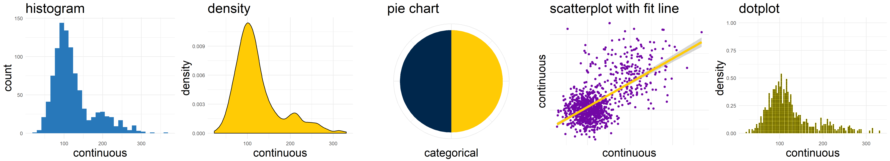
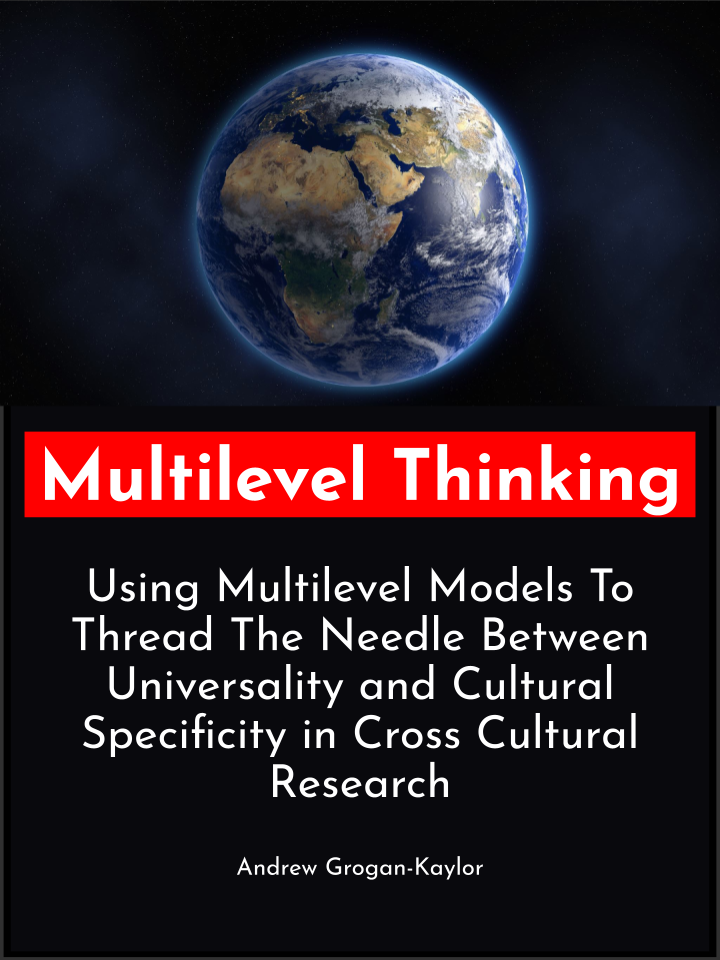
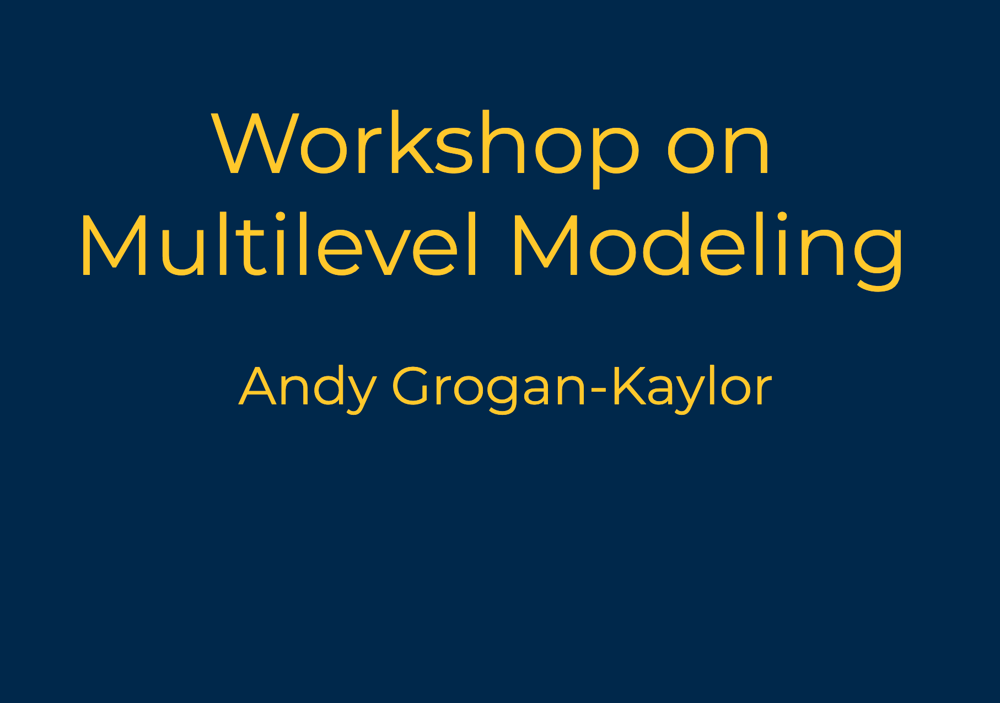
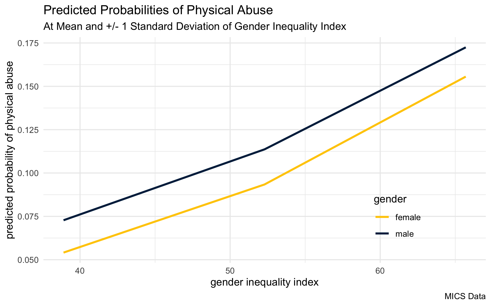
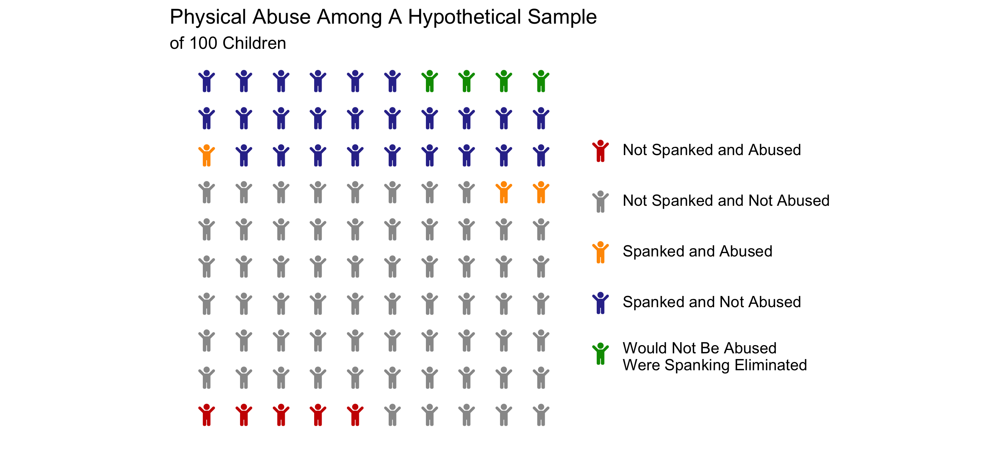
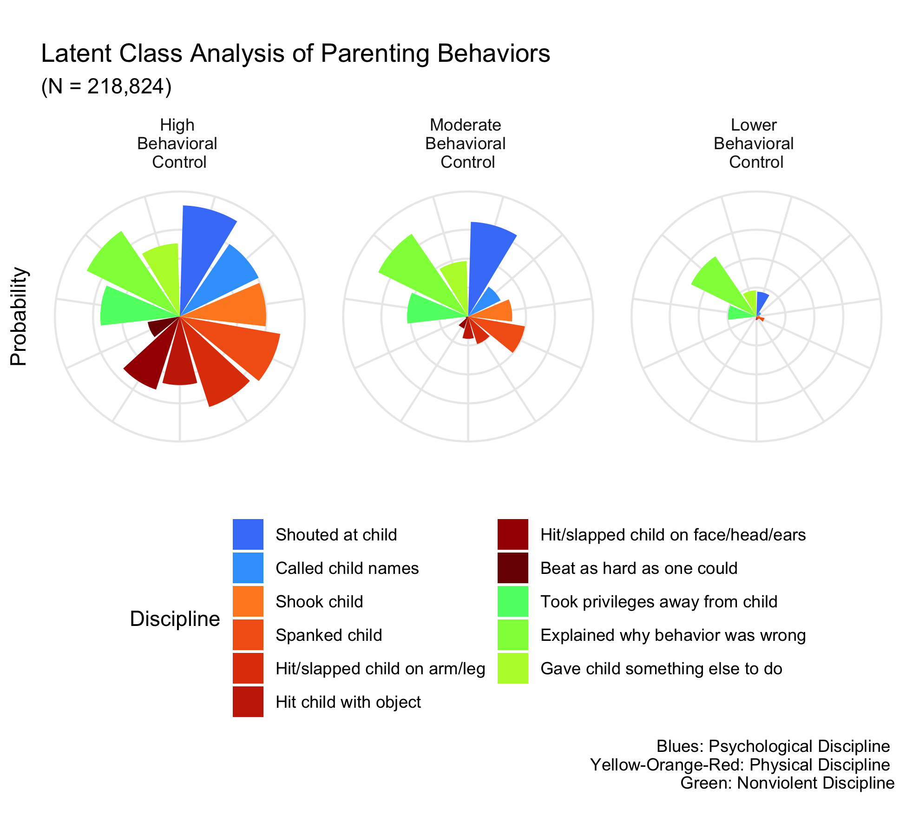
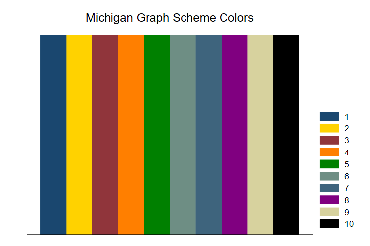
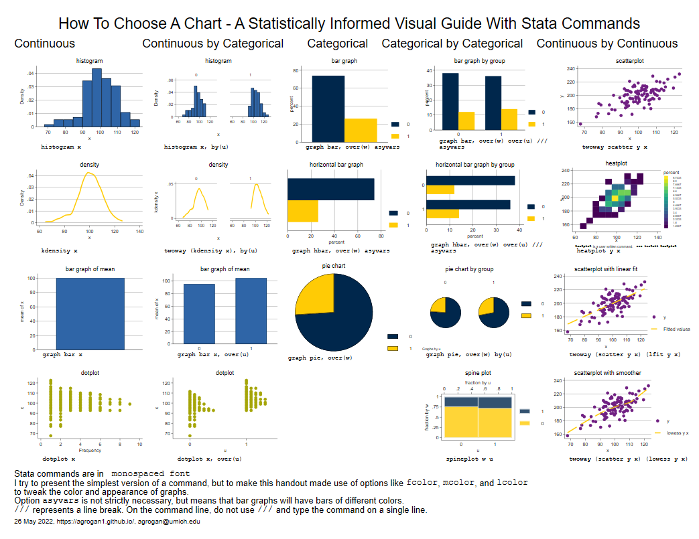
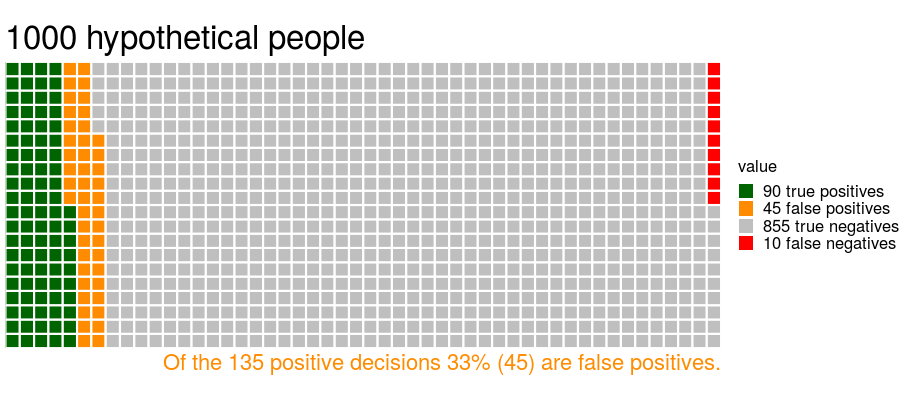
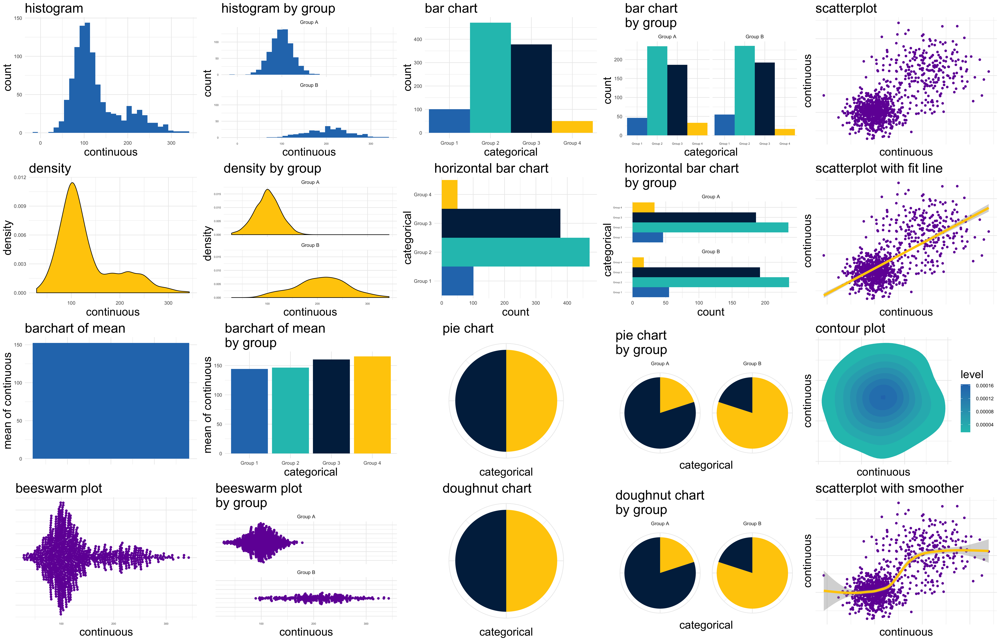

```{r setup, include=FALSE}

knitr::opts_chunk$set(echo = FALSE,
                      fig.margin = TRUE)

library(readr) # get data

library(haven) # Stata data

library(ggplot2) # beautiful graphs

library(dplyr) # data wrangling

library(tidyr) # tidy data

library(DT) # nice data table

library(tibble) # tibbles

library(countrycode) # manage country data

library(plotly) # interactive graphs

library(maps) # maps

library(maptools) # maptools

library(leaflet) # web maps

library(sp) # spatial data

library(sf) # simple features

```


```{r}


```

# About Me

My interests are in developing more knowledge to reduce violence against children and Adverse Childhood Experiences (ACEs), with the aim of improving child and family well-being. It is my hope that a better understanding of how to reduce violence against children, and how to reduce ACEs, will contribute to a better understanding of how to improve mental health and well-being across the lifespan. In this research I try to understand the family and community origins of aggression, antisocial behavior, anxiety and depression across diverse communities and contexts. My current research focuses on parenting and child development using international data. I try to understand these issues within the context of current conversations about children’s rights.

A particular focus of my work has been to examine the outcomes of physical punishment. 

> "Corporal punishment is the most common form of violence against children worldwide, leading to the
injury and death of thousands of children each year. Its very widespread social acceptance means that a
level of violence in childrearing is normalised, entrenching children’s low status and paving the way for
other forms of violence and mistreatment." [@CP10KeyMessages2022]

Working closely with many colleagues, we have shown that physical punishment is associated with a wide variety of negative outcomes. Additional quantitative work has demonstrated that this finding remains true even in contexts when physical punishment is used minimally, or when used in ostensibly "normative" ways. In a number of papers, we have investigated these associations across diverse communities and countries. Lastly, in additional papers, we have worked to demonstrate more "causally robust" associations between physical punishment and undesirable child outcomes using a variety of quantitative methods.

A more recent stream of research examines a broader range of parenting behaviors, with particular emphasis on "positive parenting" strategies.

I teach courses mostly in the area of statistics, quantitative methods and data visualization.

* A little bit about [my background](./background.html)
* My [CV](https://ssw.umich.edu/sites/default/files/documents/faculty/cvs/agrogan_cv.pdf)

# "Blog-ish" Posts 

* [posts](https://agrogan1.github.io/myposts/)

```{r}

load("./myposts/myHTMLfiles.RData") # get data on blog-ish posts

myHTMLfiles %>% 
  rownames_to_column(var = "filename") %>% # rownames to column
  filter(filename != "blogtest.html") %>%
  filter(filename != "blogtest-tint.html") %>%
  mutate(modified = mtime) %>% # copy mtime to modified
  mutate(url = paste0("<a href='", # paste together URL
                      "../myposts/", # URL is in another repo
                      filename,
                      "'>",
                      filename, 
                      "</a>")) %>% 
  select(modified, url) %>% # select columns
  datatable(rownames = FALSE, # no row names
            escape = 1, # escape URL column
            caption = "My Most Recent Blog-ish Posts",
            # sort by descending date
            options = list(pageLength = 10, 
                           order = list(list(0, 
                                             'desc')))) %>% 
  formatDate(1, 'toDateString') # format column 1 as dates

```


# Selected Courses

## Data Visualization

* [Course Page](https://agrogan1.github.io/dataviz/dataviz-course)

```{r, out.width="25%"}



```

## Multilevel and Longitudinal Modeling

* [Course Page](https://agrogan1.github.io/multilevel/)

```{r, out.width="25%"}


```

* [Multilevel Thinking](https://agrogan1.github.io/multilevel-thinking/), an *in development* introduction to multilevel modeling.

```{r, out.width="15%"}



```

* [Multilevel Workshop](https://agrogan1.github.io/multilevel-workshop/), an *in development* workshop on multilevel modeling.

```{r, out.width="25%"}



```

* [Visualizing Multilevel Models](https://agrogan1.github.io/multilevel/visualizing-MLM/visualizing-MLM.html)

```{r, out.width="25%"}

knitr::include_graphics("images/mysmallmultiples.png")

```


## Categorical Data Analysis

* [Course Page](https://agrogan1.github.io/newstuff/categorical/)

```{r, out.width="15%"}

knitr::include_graphics("images/nautilus-new.png")

```


# Research on Parenting and Child Development

Many of these publications are available from [Deep Blue](https://deepblue.lib.umich.edu/browse?type=author&value=Grogan-Kaylor%2C+Andrew). 

## Multiple Indicator Cluster Surveys (MICS) (UNICEF Data)

> This research is conducted in collaboration with colleagues [Shawna Lee](https://www.parentingincontext.org/), [Julie Ma](https://poverty.umich.edu/research/faculty-experts/julie-ma/), [Kaitlin Ward](https://www.kaitlinpward.com/), [Garrett Pace](https://www.garrettpace.com/), and [Jorge Cuartas](https://scholar.harvard.edu/jorgecuartas/home).

```{r}

data(wrld_simpl) # world map data

global_data <- st_as_sf(wrld_simpl) %>% # make an sf dataset
  select(-POP2005) # remove POP2005

# get MICS countries

country <- c("Afghanistan", "Algeria",  "Argentina",  
             "Bangladesh",  "Barbados",  "Belarus",  
             "Belize",  "Benin",  "Bosnia and Herzegovina",  
             "Cameroon",  "Central African Republic",  "Chad",  
             "Democratic Republic of the Congo",  
             "Republic of the Congo",  
             "Costa Rica",  "Cote d'Ivoire",  
             "Dominican Republic",  
             "El Salvador",  "Eswatini",  "Ghana",  
             "Guinea",  "Guinea Bissau",  "Guyana",  
             "Iraq",  "Jamaica",  "Kazakhstan",  
             "Kenya",  "Kosovo",  "Kyrgyzstan",  
             "Laos", "Macedonia",  "Madagascar",  
             "Malawi",  "Mali",  "Mauritania",  
             "Mexico",  "Moldova",  "Mongolia",  
             "Montenegro",  "Nepal",  "Nigeria",  
             "Pakistan",  "Panama",  "Paraguay",  
             "Sao Tome and Principe",  "Senegal",  "Serbia",  
             "Sierra Leone",  "Somalia",  "St. Lucia",  
             "State of Palestine",  "Suriname",  "Thailand",  
             "The Gambia",  "Togo",  "Trinidad and Tobago",  
             "Tunisia",  "Turkmenistan",  "Ukraine",  
             "Uruguay",  "Vietnam",  "Zimbabwe")

# convert to ISO3

country_iso <- countrycode(country, 
                           'country.name', 
                           'iso3c')

# MICS is an sf object that is subset of global_data

MICS <- global_data %>% 
  filter(ISO3 %in% country_iso)
  
```

```{r, fig.cap="Locations of Countries in MICS", fig.height=3}

library(leaflet)

leaflet() %>%
  setView(0, 25, zoom = 1.5) %>%
  addProviderTiles(providers$Stamen.Terrain) %>%
  addPolygons(data = MICS, 
              fillOpacity = .75, 
              color = "#5b92e5", 
              label = MICS$NAME,
              highlightOptions = highlightOptions(color = "red", 
                                                  weight = 2,
                                                  bringToFront = TRUE)) 

```

* Gender Inequality in Low- and Middle-Income Countries: Associations
with Parental Physical Abuse and Moderation by Child Gender
    + [Article](https://www.mdpi.com/1841422)
    + [ArcGIS Storymap](https://arcg.is/1WzHHP)
    + [Press Release](https://news.umich.edu/gender-inequality-can-predict-high-rates-of-child-physical-abuse/)
    
```{r, eval=TRUE, out.width="75%", fig.align = 'center'}



```
    
* "The Association between Spanking and Physical Abuse of Young Children in 56 Low- and Middle-Income Countries"
    + [Article](https://doi.org/10.1016/j.chiabu.2022.105662)
    + [Press Release](https://news.umich.edu/physical-abuse-less-likely-when-spanking-is-eliminated/)
    + [HTML Slides](https://websites.umich.edu/~parentingandchilddev/MICS-physical-abuse/MICS-physical-abuse.html)
    + [ArcGIS Storymap](https://arcg.is/fq49)
    
```{r, eval=TRUE}



```

* "Patterns of Caregiver Aggressive & Nonaggressive Discipline Toward Young Children in Low- and Middle-Income Countries: A Latent Class Approach"
    + [Article](https://doi.org/10.1016/j.chiabu.2022.105606)
    + [ArcGIS Storymap](https://arcg.is/1S5XPK)
    
```{r, eval=TRUE, out.width="50%", fig.align = 'center'}



```

* "Multilevel ecological analysis of the predictors of spanking across 65 countries"
    + [Article](https://bmjopen.bmj.com/content/11/8/e046075)
    + [ArcGIS Storymap](https://arcg.is/14CPKu)
* "Global Perspectives on Positive and Negative Parenting: A Bayesian Multilevel Analysis"
    + [Abstract](https://agrogan1.github.io/research/Bayes3MICS/)
    + [Article](https://doi.org/10.1177%2F0165025420981642)
* "Spanking and young children's socioemotional development in low- and middle-income countries"
    + [Open Access](https://doi.org/10.1016/j.chiabu.2018.11.003)
    + *Child Trends News Service* has released a well done [video summarizing this research](https://youtu.be/8LYZ-UpR5wE). 

## Adverse Childhood Experiences (ACES)

* ["Adverse childhood experiences and spanking have similar associations with early behavior problems"](https://doi.org/10.1016/j.jpeds.2021.01.072)

* ["Unpacking the impact of adverse childhood experiences on adult mental health"](http://dx.doi.org/10.1016/j.chiabu.2017.03.016) 

* ["Spanking and adult mental health impairment: The case for the designation of spanking as an adverse childhood experience"](https://doi.org/10.1016/j.chiabu.2017.01.014)  

## COVID-19

* ["Anxiety and Depression During COVID-19: Are Adults in Households with Children Faring Worse?"](https://link.springer.com/article/10.1007/s11606-021-07256-9)
    + [News Release](https://news.umich.edu/having-kids-at-home-may-reduce-pandemic-depression/)

## Colombia

* ["Physical Punishment as a Predictor of Early Cognitive Development: Evidence From Econometric Approaches"](https://www.ncbi.nlm.nih.gov/pmc/articles/PMC7983059/)
* ["Physical punishment and Colombian children and adolescents’ cognitive and behavioral outcomes"](https://doi.org/https://doi.org/10.1016/j.appdev.2020.101140)
* ["Civil conflict, domestic violence, and poverty as predictors of corporal punishment in Colombia"](https://pubmed.ncbi.nlm.nih.gov/30772750/)

## Meta-Analysis of Research on Corporal Punishment

* [Meta-Analysis](https://agrogan1.github.io/research/cp/CP-meta.html) of Research on Corporal Punishment [[PubMed Full Text](https://www.ncbi.nlm.nih.gov/pmc/articles/PMC7992110/)]

## Corporal Punishment Bans

* Data Visualizations of [Country Level Bans on Corporal Punishment](https://agrogan1.github.io/research/cpbans/)

```{r, fig.cap="Country Level Bans on Corporal Punishment"}

mydata <- read_csv("../research/cpbans/CPBans.csv") # read data

plot_geo(mydata) %>% 
  add_trace(locations = ~country_code, 
            color = ~year.of.prohibition,
            z = ~year.of.prohibition, 
            text = ~paste(country, 
                          "<br>year of prohibition:", 
                          year.of.prohibition),
            marker = list(size = 10)) %>%
  layout(geo = list(showland = FALSE,
                    showcountries = TRUE,
                    projection = list(type = 'orthographic',
                                      rotation = list(lon = -30,
                                                      lat = 10,
                                                      roll = 0)
                                      ))) %>%
  colorbar(title = 'year of prohibition') 

```


## Earlier Research on Corporal Punishment

* [Earlier Research On Corporal Punishment](https://agrogan1.github.io/research/cp/)

# Community Based Research in Alaska

* Culturally Grounded Strategies for Suicide and Alcohol Risk Prevention Delivered by Rural Alaska Native Communities: A Dynamic Wait‐listed Design Evaluation of the Qungasvik Intervention. 

    + [Open Access Article](https://onlinelibrary.wiley.com/doi/full/10.1002/ajcp.12621)

# Selected Collaborations

* Work with [Performance Measurement Initiative](https://agrogan1.github.io/research/performance-measurement-initiative) at William Davidson Institute

# Stata Materials

## All Stata Materials

* [All Stata Materials](https://agrogan1.github.io/Stata/)

## Introductory Materials

* [A *Very* Short Introduction to Stata](https://agrogan1.github.io/Stata/very-short-introduction/very-short-introduction.html)
* [*Two Page Stata*](https://agrogan1.github.io/Stata/two-page-stata/TwoPageStata.pdf)   [[HTML](https://agrogan1.github.io/Stata/two-page-stata/TwoPageStata.html)]
* [Example do File](https://github.com/agrogan1/Stata/blob/master/do-files/my_penguins.do) using the [Palmer Penguin Data](https://allisonhorst.github.io/palmerpenguins/)

## Data Visualization

* ["Michigan Graph Scheme" for Stata](https://agrogan1.github.io/Stata/michigan-graph-scheme/)
* Data Visualization With Stata 
    + [HTML](https://agrogan1.github.io/Stata/data-visualization-with-Stata/data-visualization-with-Stata.html)
    + [HTML Slides](https://agrogan1.github.io/Stata/data-visualization-with-Stata/data-visualization-with-Stata-slidy.html)
    + [PDF](https://agrogan1.github.io/Stata/data-visualization-with-Stata/data-visualization-with-Stata.pdf)
    
<aside>
```{r, fig.cap="Michigan Color Scheme For Stata Graphs"}



```
</aside>

* Stata Data Visualization **Basics**
    + [HTML](https://agrogan1.github.io/Stata/data-visualization-with-Stata-the-basics/data-visualization-with-Stata-the-basics.html)
    + [PDF](https://agrogan1.github.io/Stata/data-visualization-with-Stata-the-basics/data-visualization-with-Stata-the-basics.pdf)
* [How To Choose A Chart - A Statistically Informed Visual Guide With Stata Commands](https://agrogan1.github.io/Stata/how-to-choose-a-chart-a-visual-guide-with-Stata/how-to-choose-a-chart-a-visual-guide-with-Stata.pdf)

<aside>
```{r, fig.cap="How To Choose A Chart"}



```
</aside>

# R Materials

## R

* *Introduction to R*: 
     + [HTML Web Book](https://agrogan1.github.io/R/introduction-to-R/introduction-to-R.html) 
     + [PDF](https://agrogan1.github.io/R/introduction-to-R/introduction-to-R.pdf) 
     + [epub](https://agrogan1.github.io/R/introduction-to-R/introduction-to-R.epub)
* *Quick Introduction To R*: 
     + [PDF](https://agrogan1.github.io/R/quick-intro-R/quick-intro-R.pdf)
     + [HTML](https://agrogan1.github.io/R/quick-intro-R/quick-intro-R.html)
* Colors in R
     + [Colors in R](https://agrogan1.github.io/R/colors/colors.html)
     + [Viridis Colors](https://agrogan1.github.io/R/viridis/viridis.html)
     + University of Michigan colors for R Graphs [[web page](https://agrogan1.github.io/R/michigancolors-demo/michigancolors-demo.html)] [[R package](https://agrogan1.github.io/michigancolors/)]
     
<aside>
```{r, fig.cap="Michigan Color Scheme For R Graphs"}


```
</aside>  

* *Working With Data From the World Bank Indicators*
     + [HTML](https://agrogan1.github.io/R/wbdemo/)

## ggplot

* *Introduction to ggplot2*: 
     + [HTML Web Book](https://agrogan1.github.io/R/introduction-to-ggplot2/introduction-to-ggplot2.html) 
     + [PDF](https://agrogan1.github.io/R/introduction-to-ggplot2/introduction-to-ggplot2.pdf)
     + [epub](https://agrogan1.github.io/R/introduction-to-ggplot2/introduction-to-ggplot2.epub)
* *Two Page ggplot2*: 
     + [PDF](https://agrogan1.github.io/R/two-page-ggplot2/two-page-ggplot2.pdf)
* [*What Geometry Do I Use?*](https://agrogan1.github.io/R/what-geom-do-I-use/how-to-choose-a-chart-a-visual-guide-GEOMs.pdf)
* [*ggplot Flipbook*](https://agrogan1.github.io/R/ggplot-flipbook/ggplot-flipbook.html#1)
* [*"Advanced" ggplot*](https://agrogan1.github.io/dataviz/advanced-ggplot/advanced-ggplot.html)
* *Comparing Program Outcomes with ggplot2* 
     + [HTML](https://agrogan1.github.io/myposts/comparing-program-outcomes-with-ggplot2.html)
     + [PDF](https://agrogan1.github.io/myposts/comparing-program-outcomes-with-ggplot2.pdf)

## dplyr

* *Multi-Page dplyr*:
     + [PDF](https://agrogan1.github.io/R/multi-page-dplyr/multi-page-dplyr.pdf)
     + [HTML](https://agrogan1.github.io/R/multi-page-dplyr/multi-page-dplyr.html)

## xaringan

* [*Themes for the Xaringan Slide Show System*](https://agrogan1.github.io/R/xaringan-themes/)

# Bayesian Statistics

## Introductory Materials

* [Thinking Through Bayesian Ideas](https://agrogan.shinyapps.io/Thinking-Through-Bayes/)
* Notes on [Accepting the Null ($H_0$) Hypothesis](https://agrogan1.github.io/Bayes/accepting-H0/accepting-H0.html)

## Multilevel Modeling

* [Bayesian and Frequentist Multilevel Modeling](https://agrogan1.github.io/multilevel/Bayesian-and-frequentist-MLM/Bayesian-and-frequentist-MLM.html)
* [Bayesian Longitudinal MLM With the Gutten Tree Data](https://agrogan1.github.io/multilevel/Bayesian-longitudinal-mlm/Bayesian-longitudinal-mlm.html) 

<aside>
```{r, fig.cap="Thinking Through Bayesian Ideas"}



```
</aside>

# Statistical Tutorials and Visualizations

## Introductory Materials

* [What Is Data?](https://agrogan1.github.io/teaching/what-is-data/what-is-data.html)
* [Everything is Obvious Once You Know The Answer](https://agrogan1.github.io/teaching/everything-is-obvious/everything-is-obvious.html)
* [Notes on Quantitative Workflow](https://agrogan1.github.io/teaching/workflow/workflow.html)
* Basics of [Quantitative Data Analysis](https://agrogan1.github.io/teaching/quantitative-data-analysis/quantitative-data-analysis.html)

## Causality

* [Causality](https://agrogan.shinyapps.io/causality/)

## Bivariate Statistics

* [t-Test](https://agrogan.shinyapps.io/shiny-t-test/)
* Correlation
    + [The Basics](https://agrogan.shinyapps.io/correlation_demo/)
    + [Thinking about Correlations](https://agrogan.shinyapps.io/thinking_about_correlations/)
* [Cohen's d Calculator](https://agrogan.shinyapps.io/es_calculator/)
    
## Multivariate Statistics

* Regression
    + [Tutorial](https://agrogan1.github.io/teaching/new-regression-tutorial/)
    + [Demo](https://agrogan.shinyapps.io/regression_demo/)
* [Interactions](https://agrogan1.github.io/teaching/interactions/interactions.html)
* [Logistic Regression](https://agrogan.shinyapps.io/exploring_logistic_regression/)

# Mapping and GIS

[Notes for a course in development](https://agrogan1.github.io/mapping/) on GIS and Mapping

<aside>
```{r, fig.cap="Orthographic (Globe) Projection", fig.height=2, warning=FALSE, eval=FALSE}

m <- list(
  l = 5,
  r = 5,
  b = 5,
  t = 5,
  pad = 4
)

plot_geo() %>%
  layout(title = "", 
         autosize = F, 
         width = 100, 
         height = 100,
         margin = m,
         geo = list(projection = list(type = 'orthographic'),
                    showland = TRUE,  
                    landcolor = toRGB("grey"),
                    showcountries = TRUE,
                    showocean = FALSE, 
                    oceancolor = "LightBlue",
                    lataxis = list(showgrid = TRUE,
                                   gridcolor = toRGB("black")),
                    lonaxis = list(showgrid = TRUE,
                                   gridcolor = toRGB("black"))))

```
</aside>

# Data Visualization

* How To Choose A Chart
    + [How to Choose a Chart: A Visual Guide](https://agrogan1.github.io/dataviz/how-to-choose-a-chart/how-to-choose-a-chart-a-visual-guide.pdf). 
    + [How to Choose a Chart: An Intuitive Guide](https://agrogan1.github.io/dataviz/how-to-choose-a-chart-intuitive/how-to-choose-a-chart-intuitive.html)
    + [Extended Version](https://agrogan1.github.io/dataviz/how-to-choose-a-chart/how-to-choose-a-chart-v3.html)
* [Should Everything Be A Bar Graph?](https://agrogan1.github.io/dataviz/should-everything-be-a-bar-graph/#1)
* [Data Driven Report Demo](https://agrogan1.github.io/dataviz/data-driven-report-demo/)
* [Variables and Visualization](https://agrogan1.github.io/dataviz/variables-and-visualization/variables-and-visualization.html#/)
* Slides for a Lecture on [Data Visualization for Political Social Work](https://agrogan1.github.io/dataviz/political-social-work/)

<aside>
```{r, fig.cap="How To Choose A Chart"}



```
</aside>

## Telling Stories With Data

* [Visualizing Disparities in a Continuous Risk Factor or Outcome](https://agrogan1.github.io/myposts/visualizing-disparities-in-a-continuous-outcome.html) [[PDF](https://agrogan1.github.io/myposts/visualizing-disparities-in-a-continuous-outcome.pdf)]
* [Visualizing Disparities in a Categorical Risk Factor or Outcome](https://agrogan1.github.io/myposts/visualizing-disparities-in-a-categorical-outcome.html)
* [Comparing Program Outcomes With ggplot](https://agrogan1.github.io/myposts/comparing-program-outcomes-with-ggplot2.html) [[PDF](https://agrogan1.github.io/myposts/comparing-program-outcomes-with-ggplot2.pdf)]
* [Graphing Change Over Time](https://agrogan1.github.io/dataviz/graphing-change-over-time/index.html) [[PDF](https://agrogan1.github.io/dataviz/graphing-change-over-time/index.pdf)]

# Contact

Andrew Grogan-Kaylor

* **Web:** [https://agrogan1.github.io/](https://agrogan1.github.io/)
* **Email:** [agrogan@umich.edu](agrogan@umich.edu)
* **Deep Blue:** [https://deepblue.lib.umich.edu/browse?type=author&value=Grogan-Kaylor%2C+Andrew](https://deepblue.lib.umich.edu/browse?type=author&value=Grogan-Kaylor%2C+Andrew)
* **GitHub:** [https://github.com/agrogan1](https://github.com/agrogan1)
* **ResearchGate:**  [https://www.researchgate.net/profile/Andrew_Grogan-Kaylor](https://www.researchgate.net/profile/Andrew_Grogan-Kaylor)
* **Google Scholar:**  [https://scholar.google.com/citations?user=iLvsGzgAAAAJ&hl=en](https://scholar.google.com/citations?user=iLvsGzgAAAAJ&hl=en)
* **ORCID:** [https://orcid.org/0000-0003-0065-9991](https://orcid.org/0000-0003-0065-9991)


