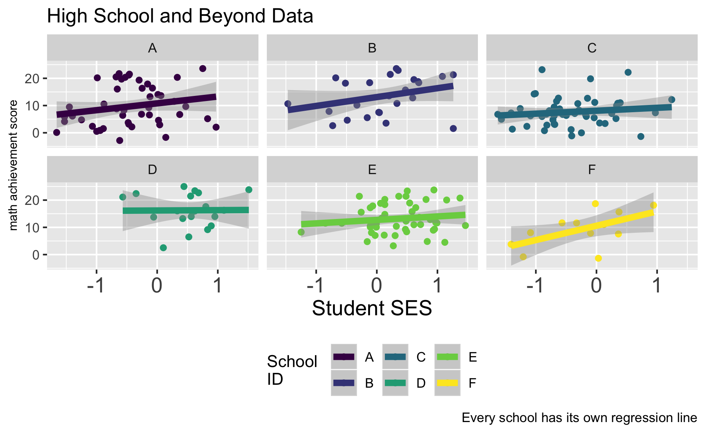
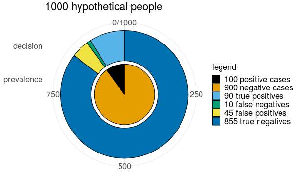

```{r setup, include=FALSE}

knitr::opts_chunk$set(echo = FALSE,
                      fig.margin = TRUE)

library(ggplot2)

library(dplyr) # data wrangling

library(DT) # nice data table

library(tibble) # tibbles

```


```{r, layout="l-screen"}


```

# My Background

A little bit about [my background](./background.html)

# "Blog-ish" Posts 

* [posts](https://agrogan1.github.io/myposts/)

```{r}

load("../myposts/myHTMLfiles.RData") # get data on blog-ish posts

myHTMLfiles %>% 
  rownames_to_column(var = "filename") %>% # rownames to column
  filter(filename != "blogtest.html") %>%
  filter(filename != "blogtest-tint.html") %>%
  mutate(modified = mtime) %>% # copy mtime to modified
  mutate(url = paste0("<a href='", # paste together URL
                      "../myposts/", # URL is in another repo
                      filename,
                      "'>",
                      filename, 
                      "</a>")) %>% 
  select(modified, url) %>% # select columns
  datatable(rownames = FALSE, # no row names
            escape = 1, # escape URL column
            caption = "My Most Recent Blog-ish Posts",
            # sort by descending date
            options = list(pageLength = 3, 
                           order = list(list(0, 
                                             'desc')))) %>% 
  formatDate(1, 'toDateString') # format column 1 as dates

```


# Courses

* [Multilevel and Longitudinal Modeling](https://agrogan1.github.io/multilevel/)

<aside>
```{r}



```
</aside>

# Research on Parenting

* [Data Visualization](https://agrogan1.github.io/research/MICS1/) for "Spanking and young children's socioemotional development in low- and middle-income countries". *Child Trends News Service* has released a well done [video summarizing this research](https://youtu.be/8LYZ-UpR5wE).
* [Research On Corporal Punishment](https://agrogan1.github.io/research/cp/)
* Data Visualization of [Country Level Bans on Corporal Punishment](https://agrogan1.github.io/research/cpbans/)

<aside>
```{r}

knitr::include_graphics("images/MICSglobe.png")

knitr::include_graphics("images/cpbansglobe.png")

```
</aside>

# Selected Collaborations

* Work with [Performance Measurement Initiative](https://agrogan1.github.io/research/performance-measurement-initiative) at William Davidson Institute

# R Materials

* *Introduction to R*: 
     + [HTML Web Book](https://agrogan1.github.io/R/introduction-to-R/background.html) 
     + [PDF](https://agrogan1.github.io/R/introduction-to-R/introduction-to-R.pdf) 
     + [epub](https://agrogan1.github.io/R/introduction-to-R/introduction-to-R.epub)
* *Introduction to ggplot2*: 
     + [HTML Web Book](https://agrogan1.github.io/R/introduction-to-ggplot2/background.html) 
     + [PDF](https://agrogan1.github.io/R/introduction-to-ggplot2/introduction-to-ggplot2.pdf)
     + [epub](https://agrogan1.github.io/R/introduction-to-ggplot2/introduction-to-ggplot2.epub)
* University of Michigan colors for R Graphs: 
     + [web page](https://agrogan1.github.io/R/michigancolors-demo/michigancolors-demo.html) 
     + [R package](https://agrogan1.github.io/michigancolors/)
* *Two Page R*: 
     + [PDF](https://agrogan1.github.io/R/two-page-R/two-page-R.pdf)
* *Two Page ggplot2*: 
     + [PDF](https://agrogan1.github.io/R/two-page-ggplot2/two-page-ggplot2.pdf)
* *Five Page dplyr*:
     + [PDF](https://agrogan1.github.io/R/five-page-dplyr/five-page-dplyr.pdf)
     + [HTML](https://agrogan1.github.io/R/five-page-dplyr/five-page-dplyr.html)
* *Comparing Program Outcomes with ggplot2* 
     + [HTML](https://agrogan1.github.io/myposts/comparing-program-outcomes-with-ggplot2.html)

# Stata Materials

* *Two Page Stata*: 
     + [HTML](https://agrogan1.github.io/Stata/two-page-stata/TwoPageStata.html) 
     + [PDF](https://agrogan1.github.io/Stata/two-page-stata/TwoPageStata.pdf)
     + [epub](https://agrogan1.github.io/Stata/two-page-stata/TwoPageStata.epub)
* ["Michigan Graph Scheme" for Stata](https://agrogan1.github.io/Stata/)
* [Better Graphing in Stata](https://agrogan1.github.io/Stata/stata-graphing/)
* [Miscellaneous Stata Programs](https://agrogan1.github.io/Stata/)

# Bayesian Statistics

* [Demonstration of Bayesian Ideas](https://agrogan.shinyapps.io/shinyBayes/)
* [Bayesian Calculations](https://agrogan1.github.io/Bayes/) [[Draft Interactive Version](https://agrogan.shinyapps.io/shinyBayes2/)]

<aside>
```{r}



```
</aside>

# Statistical Visualizations

* [t-test](https://agrogan.shinyapps.io/shiny-t-test/)
* [correlation](https://agrogan.shinyapps.io/correlation_demo/)
* [regression](https://agrogan.shinyapps.io/regression_demo/)
* [logistic regression](https://agrogan.shinyapps.io/exploring_logistic_regression/)
* [Cohen's d Calculator](https://agrogan.shinyapps.io/effect_size_calculator/)

# Data Visualization

* [How to Choose a Chart: A Visual Guide](https://agrogan1.github.io/dataviz/how-to-choose-a-chart/how-to-choose-a-chart-a-visual-guide.pdf). [[Extended Version](https://agrogan1.github.io/dataviz/how-to-choose-a-chart/how-to-choose-a-chart-v3.html)]
* [Variables and Visualization](https://agrogan1.github.io/dataviz/variables-and-visualization/variables-and-visualization.html#/)
* [Graphing Change Over Time](https://agrogan1.github.io/dataviz/graphing-change-over-time/index.html) [[PDF](https://agrogan1.github.io/dataviz/graphing-change-over-time/index.pdf)]
* Slides for a Lecture on [Data Visualization for Political Social Work](https://agrogan1.github.io/dataviz/political-social-work/)

# Created By 

Andrew Grogan-Kaylor

* [https://umich.edu/~agrogan](https://umich.edu/~agrogan) 
* [agrogan@umich.edu](agrogan@umich.edu)


