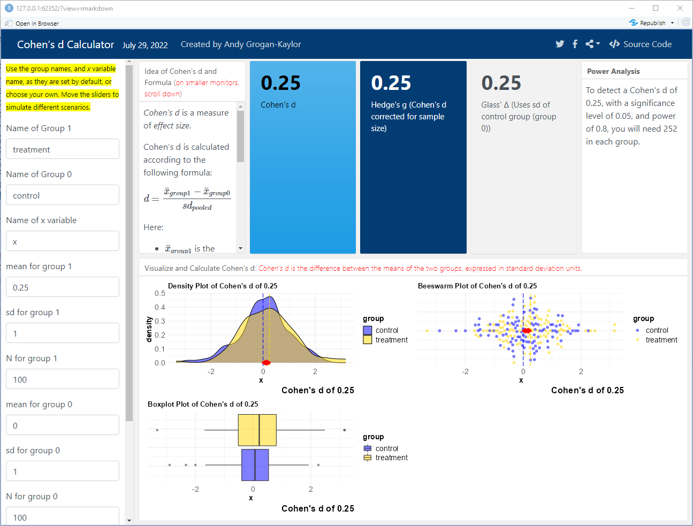

```{r setup, include=FALSE}

knitr::opts_chunk$set(echo = FALSE)

```

# Effect Sizes 

Let's imagine that you are studying an outcome like a *mental health outcome*. 

Suppose that your control group has a mean score of 100, and a standard deviation of 5 on this outcome. 

Suppose that your treatment group has a mean score of 110, and a standard deviation of 7 on this outcome.

# Statistical Significance

It's relatively easy to test for the *statistical significance* of this difference, as one can see in the example below.

```{r, echo=TRUE}

options(scipen = 999) # turn off scientific notation

N <- 100 # sample size

control <- rnorm(N, 100, 5) # control group data

treatment <- rnorm(N, 110, 7) # control group data

t.test(treatment, control) # t-test of treatment vs. control

```

# Substantive Significance

But what if you want to think about the *substantive significance* of the difference between treatment and control group? Effect sizes are *one way* to think about these issues. Discussion about the *merits of*, and *calculation of* effect sizes is *energetic* and *complex*. However, one commonly accepted way of thinking about effect sizes is *Cohen's d*.

# Cohen's d Calculator

I have recently updated my calculator to calculate and visualize Cohen's d. It can be found here: [https://agrogan.shinyapps.io/es_calculator/](https://agrogan.shinyapps.io/es_calculator/).

```{r, out.width="75%", echo=FALSE}



```


