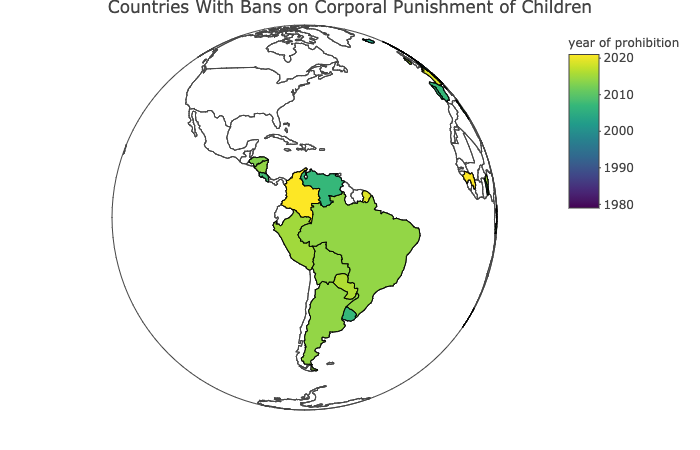

```{r setup, include=FALSE}

knitr::opts_chunk$set(echo = FALSE)

```

Colombia is the 63rd country to ban corporal punishment: [https://agrogan1.github.io/research/cpbans/](https://agrogan1.github.io/research/cpbans/)


```{r}



```

