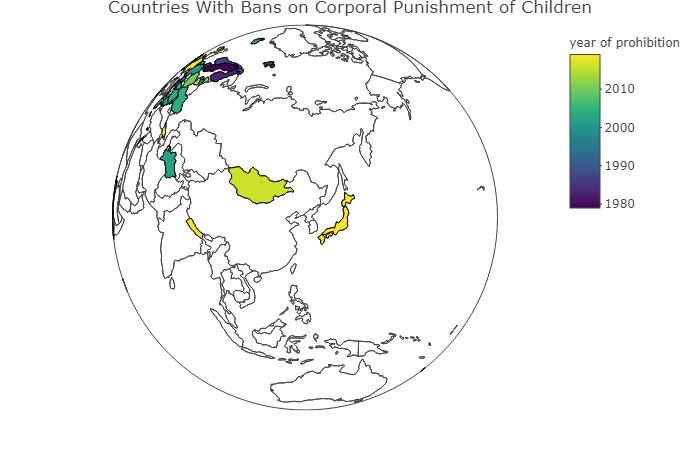

```{r setup, include=FALSE}

knitr::opts_chunk$set(echo = FALSE)

```

Japan is [the 59th country to institute a country level ban on the use of physical punishment](https://agrogan1.github.io/research/cpbans/).


```{r}



```


