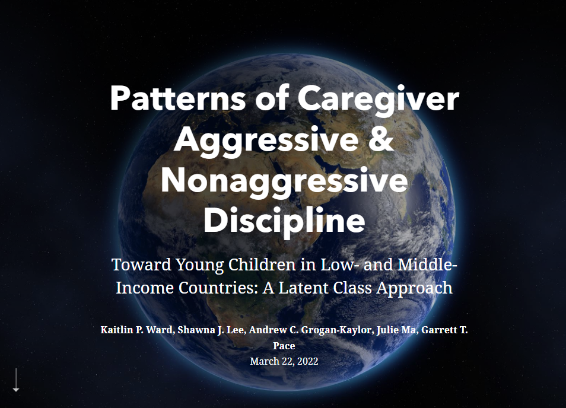

```{r setup, include=FALSE}

knitr::opts_chunk$set(echo = FALSE)

```

We've published a new article. You can find an ArcGIS storymap concerning the article [here](https://arcg.is/1S5XPK).

```{r, eval=TRUE}



```