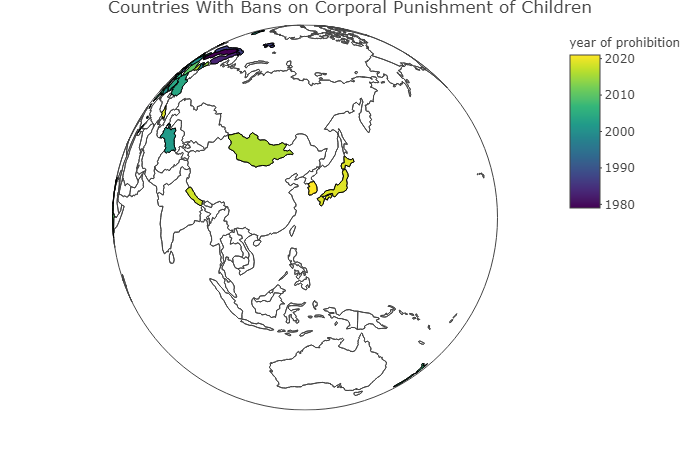

```{r setup, include=FALSE}

knitr::opts_chunk$set(echo = FALSE)

```

South Korea is the 62nd Country to Ban Corporal Punishment: [https://agrogan1.github.io/research/cpbans/](https://agrogan1.github.io/research/cpbans/)


```{r}



```

