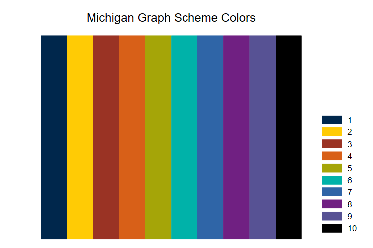

```{r setup, include=FALSE}

knitr::opts_chunk$set(echo = FALSE)

```

I've updated my *Michigan Colors for Stata Graphs* at:  [https://agrogan1.github.io/Stata/michigan-graph-scheme/](https://agrogan1.github.io/Stata/michigan-graph-scheme/)

```{r, fig.cap="Michigan Graph Scheme Colors"}



```

