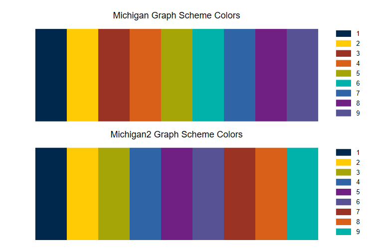

```{r setup, include=FALSE}

knitr::opts_chunk$set(echo = FALSE)

```

I've updated my *Michigan Colors for Stata Graphs* at:  [https://agrogan1.github.io/Stata/michigan-graph-scheme/](https://agrogan1.github.io/Stata/michigan-graph-scheme/).

The updated graph scheme includes the original `michigan` scheme with University of Michigan colors, but also a remixed version, `michigan2`, where blue and maize are followed by most of the cooler colors of the palette, the warmer colors of the palette, and finally *Taubman Teal*. 

```{r, fig.cap="Michigan Graph Scheme Colors"}



```

