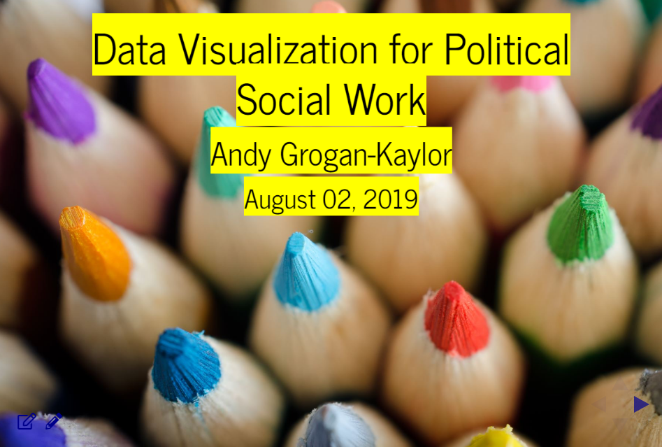

```{r setup, include=FALSE}

knitr::opts_chunk$set(echo = FALSE)

```

This is just a quick post to note that I have developed a video lecture on *Data Visualization for Political Social Work* for the University of Michigan School of Social Work Continuing Education Program on *Political Social Work*. 

<aside>
```{r}



```
</aside>

You can hear the lecture by [signing up for the course](https://ssw.umich.edu/offices/continuing-education/certificate-courses/political-social-work), but I have posted a link to the slides [on my main page](https://agrogan1.github.io/#data-visualization). Here is a [direct link](https://agrogan1.github.io/dataviz/political-social-work/#/).

