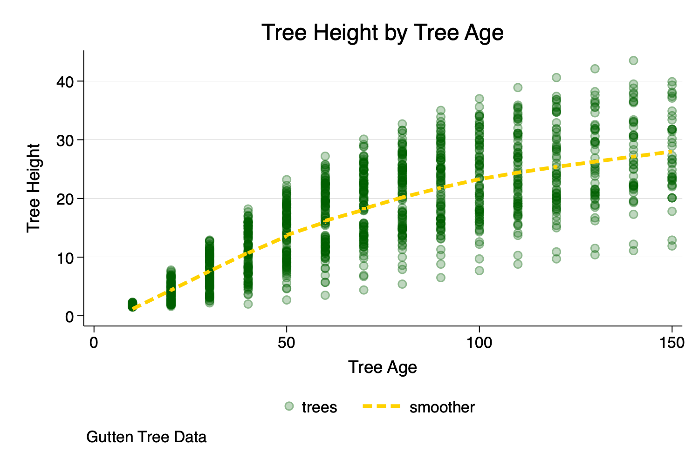

```{r setup, include=FALSE}

knitr::opts_chunk$set(echo = FALSE)

```

```{r}



```


Stata is a powerful and intuitive data analysis program. However, Stata is often under-appreciated as data visualization software. Learning how to graph in Stata is an important part of learning how to use Stata. Yet, the default graphs in Stata can sometimes be less than optimal. However, with a few tweaks, graphs in Stata can be very professional looking and aesthetically appealing.

I posted a few materials on using Stata for data visualization:

* [Data Visualization With Stata](https://agrogan1.github.io/Stata/data-visualization-with-Stata/data-visualization-with-Stata-slidy.html) [[PDF](https://agrogan1.github.io/Stata/data-visualization-with-Stata/data-visualization-with-Stata.pdf)] 
* [The Basics of Data Visualization With Stata](https://agrogan1.github.io/Stata/data-visualization-with-Stata-the-basics/data-visualization-with-Stata-the-basics.html) ([PDF](https://agrogan1.github.io/Stata/data-visualization-with-Stata-the-basics/data-visualization-with-Stata-the-basics.pdf))


