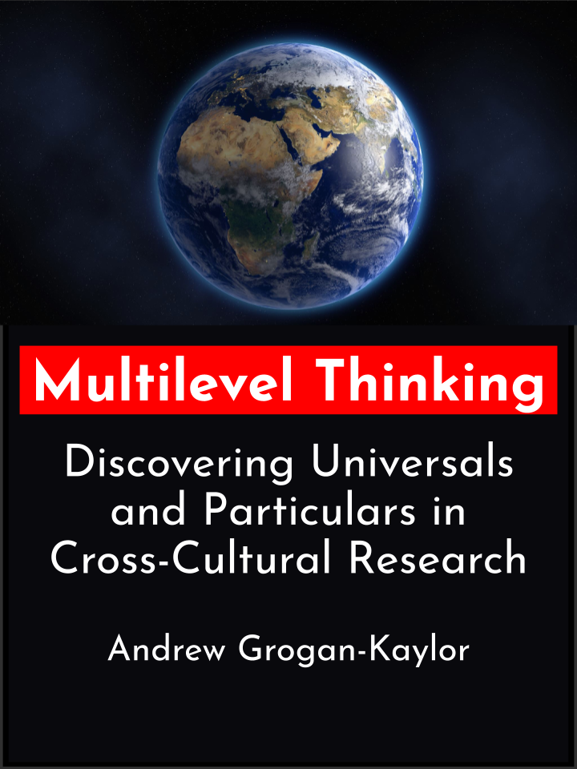

```{r setup, include=FALSE}

knitr::opts_chunk$set(echo = FALSE)

```

```{css, echo=FALSE}

d-article blockquote {
  color: black;
  border-left: 2px solid #FFCB05; 
  padding: 0.5em 10px;
}
  
```

I have been working on a project entitled [*Multilevel Thinking*](https://agrogan1.github.io/multilevel-thinking/). In this document, I try to provide clear explanations of ideas that may be well known in the statistical literature, but not that often used in the applied, or advocacy based, research literature. I use cross-cultural research as an example, but the ideas are equally applicable whether applied to studying *children in schools*, *residents in neighborhoods*, or *individuals or families in countries*.

<aside>
```{r, fig.height=3}



```
</aside>

The document started out as a set of notes on *things I only get to discuss during breaks, or after class, or during office hours* in my class on *Multilevel and Longitudinal Modeling*, and has grown from that set of notes into a draft introduction to multilevel modeling:

> [https://agrogan1.github.io/multilevel-thinking/](https://agrogan1.github.io/multilevel-thinking/)

I am hoping to find a publisher this year. 


