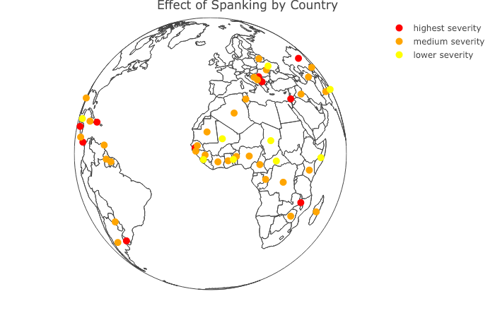

```{r setup, include=FALSE}
knitr::opts_chunk$set(echo = FALSE)
```

With my colleagues Garrett Pace and Shawna Lee, I've published a new paper, "Spanking and young children’s socioemotional development in low- and middle-income countries":

* https://agrogan1.github.io/MICS1/
* https://www.sciencedirect.com/science/article/pii/S0145213418304095?via%3Dihub





