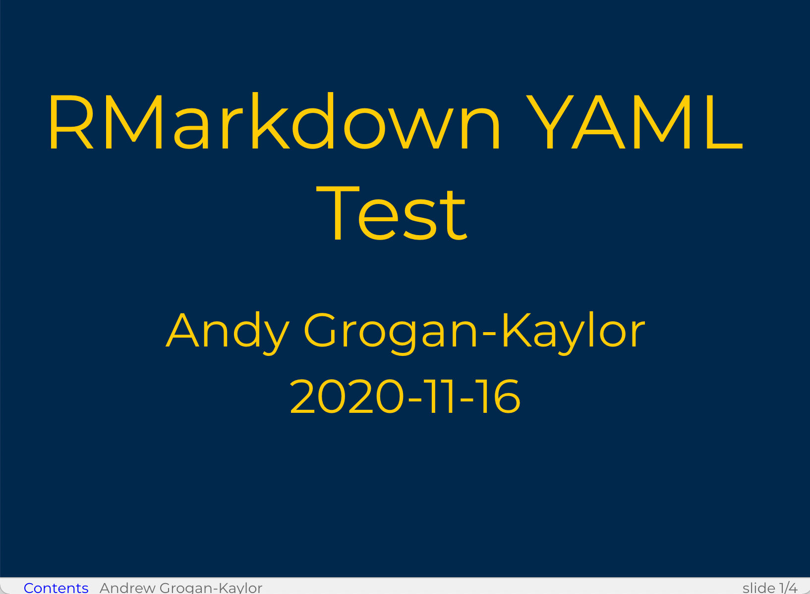
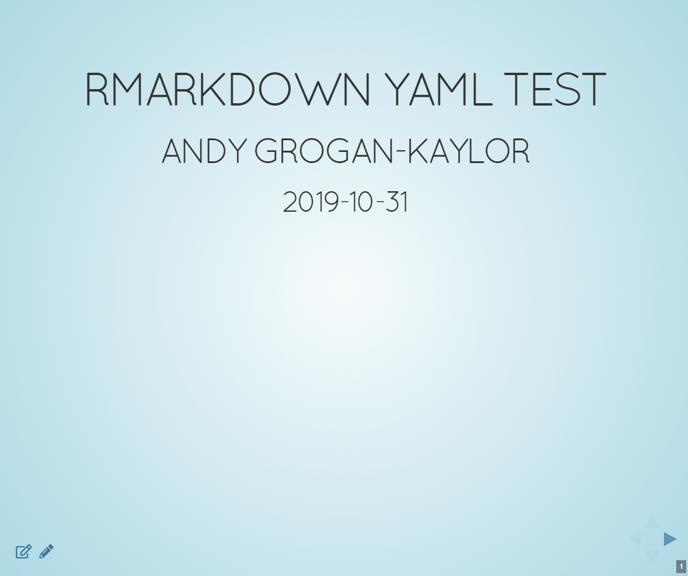
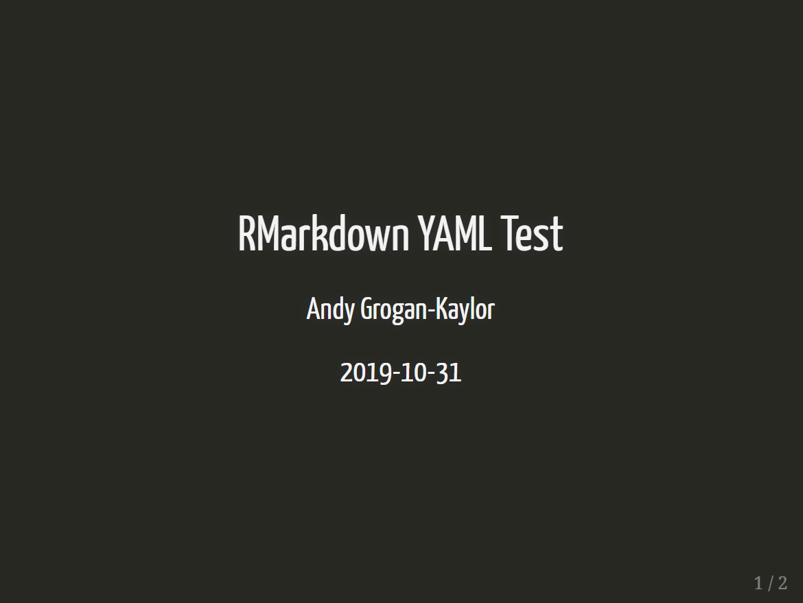
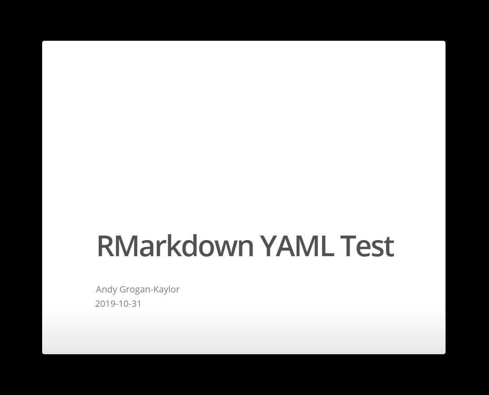

```{r setup, include=FALSE}

knitr::opts_chunk$set(echo = FALSE, 
                      warning = FALSE,
                      message = FALSE,
                      fig.margin = TRUE)

library(tint)

library(pander)

```

# Background

Over the past few years, I have been experimenting a lot with different slide show formats. Some slide formats make beautiful slides, but every format seems to have its own limitations.

Here are some key dimensions of slide formats:

```{r, fig.cap="Slidy with Custom CSS"}



```


```{r, fig.cap="RevealJS with Sky Theme"}



```

```{r, fig.cap="Xaringan"}



```

```{r, fig.cap="Ioslides"}



```

* *Basic Aesthetic*: Does the slide format look pleasing and well designed *out of the box*?

* *Overflow*: Does the slide format allow for overflow of content automatically, or if content is too long, is it cut off at the bottom? 

> This seems an especially relevant feature for designing the often complicated and lengthy slides that might go into a class. I do try to keep my slides short and simple, but some topics are inherently complicated, and lead to lengthier slides that may overflow the screen size.

* *Themes*: Can the slides be easily customized for different looks?

* *Two Dimensional Slideshows*: Right now *reveal.js* seems to be the only format that allows for 2D slideshows.

* *CSS*: Another customization consideration. Can CSS be easily used to customize the design of slides?

* *Outline View*: Does the format have an outline view? This seems especially useful, again, for classes, and online lectures.

* *Printing*: Is it easy to print, especially to PDF? Again, especially useful for classes.

In thinking about using RMarkdown slide formats, it is worth noting that most of these formats seem to behave best making use of Level 2 (`##`) Headings in RMarkdown. Various slide formats have various behaviors with Level 1 (`#`) Headings, or mixtures of Level 1 (`#`) and Level 2 (`##`) Headings, that you may be accustomed to using in other RMarkdown formats. Therefore, if you are developing one single RMarkdown document that you intend to write out to slides and to another format such as PDF, it is worth thinking about the fact that headings seem to behave uniquely in RMarkdown slide formats.

My favorite format is Slidy right now, because it allows slides to easily overflow, and because it can easily be modified with [custom CSS](UMslidy.css). My **workflow** right now is to use Slidy for presentation slides, and then render the RMarkdown document as PDF for PDF handouts.

Reveal.js is available through traditional RMarkdown, but is also the slide system available through the new [https://quarto.org/](https://quarto.org/) technology. This new version of Reveal.js has radically improved over the prior version and offers a number of customization options.  Scrollability of overflow content is still tricky with Reveal.js. Reveal.js slides are probably the best choice if the majority of your users are going to be accessing slides through a mobile browser.

```{r}

library(dplyr) # data wrangling

library(labelled) # for data labels

library(DT) # nifty data tables

```


```{r}

package_name <- c("ioslides",
                  "slidy",
                  "reveal.js",
                  "xaringan")

URL <- c("https://bookdown.org/yihui/rmarkdown/ioslides-presentation.html",
         "https://bookdown.org/yihui/rmarkdown/slidy-presentation.html",
         "https://bookdown.org/yihui/rmarkdown/revealjs.html",
         "https://slides.yihui.name/xaringan/")

basic_aesthetic <- c("nice clean design",
                     "boring",
                     "good basic design",
                     "good basic design")

overflow <- c("no",
              "yes",
              "tricky, but improving, when used with Quarto",
              "no")

themes <- c("no",
            "bootstrap",
            "reveal.js",
            "Xaringan")

two_dimensional_slideshows <- c("no",
                                "no",
                                "yes",
                                "no")
css <- c("difficult",
         "easy-ish",
         "easy-ish",
         "easy-ish")

outline_view <- c("yes",
                  "no",
                  "yes",
                  "yes, with xaringanExtra()")

printing <- c("easy",
              "difficult",
              "difficult",
              "easy")


printing <- labelled(printing, 
                     NULL, 
                     label = "Printable e.g. to PDF")

slideformats <- tibble::tibble(package_name,
                               URL,
                               basic_aesthetic, 
                               overflow,
                               themes, 
                               two_dimensional_slideshows,
                               css,
                               outline_view, 
                               printing)

slideformats <- slideformats %>% 
  mutate(package_name = paste0("<a href='", 
                      URL,
                      "'>",
                      package_name, 
                      "</a>")) %>% 
  select(-URL)


```

# Formats

Note that the table below will scroll to the right.

```{r}

datatable(slideformats,
          escape = 1, # escape URL column
          extensions = c('Buttons','FixedColumns'),
          options = list(
            dom = 't',
            scrollX = TRUE,
            fixedColumns = list(leftColumns = 2)))


```

# A Quick Note About `xaringan`.

[xaringan](https://slides.yihui.name/xaringan/) is a new package that makes it easy to make nicely formatted slides. It is worth noting, however. that: 

* `xaringan` makes use of `remark.js` to format slides, while other Rmarkdown formats use `pandoc`. `remark.js` implements most of the basic Rmarkdown syntax, but not all. Some features, such as *footnotes*, may not work as expected with `xaringan`.
* `xaringan` uses `---` to separate slides, while also using (`#`) to indicate headings. But `#` by itself does not indicate a new slide. Thus, `xaringan` may not work well in situations where you want to write the same RMarkdown file out to *multiple* formats, such as slides, HTML, PDF handouts, etc.  If you are going to also write your slides out to another format, such as PDF handouts, `slidy` may produce better results.
* `xaringan` is a rapidly developing slide "ecosystem". In particular, `xaringan` provides a number of enhancements—especially easy sharing of slides on social media—through the `xaringanExtra` library. 


