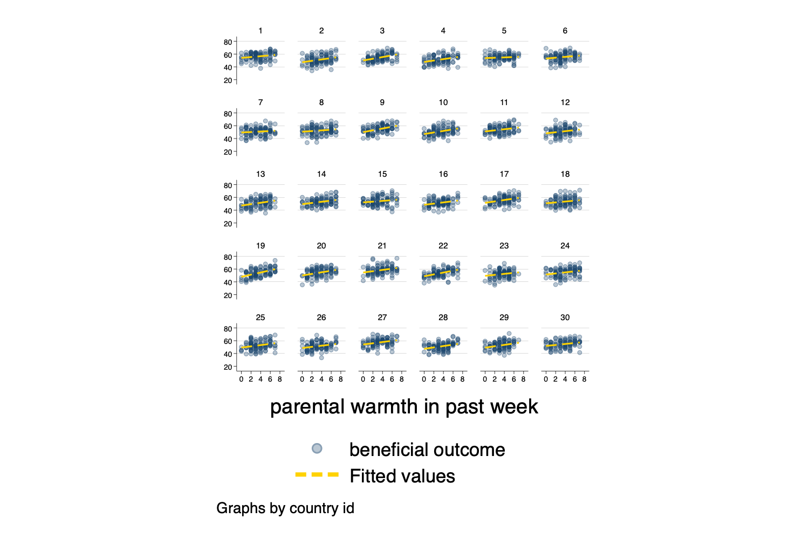

```{r setup, include=FALSE}

knitr::opts_chunk$set(echo = FALSE)

```

I have developed a book draft on multilevel modeling, entitled [*Multilevel Thinking*](https://agrogan1.github.io/multilevel-thinking/). The book draft discusses multilevel modeling in the context of cross cultural, or international, research. 

I have been thinking more about one of the ideas in that book draft: [multilevel models as the *exploration* of variation and diversity](https://agrogan1.github.io/multilevel-thinking/conceptual-framework.html#sec-studyvariation).

With those ideas in mind, I am developing a [tutorial on visualizing multilevel models](https://agrogan1.github.io/multilevel/visualizing-MLM/visualizing-MLM-slidy.html#(1)). 

```{r, fig.height=3, fig.cap="Small Multiples"}



```


