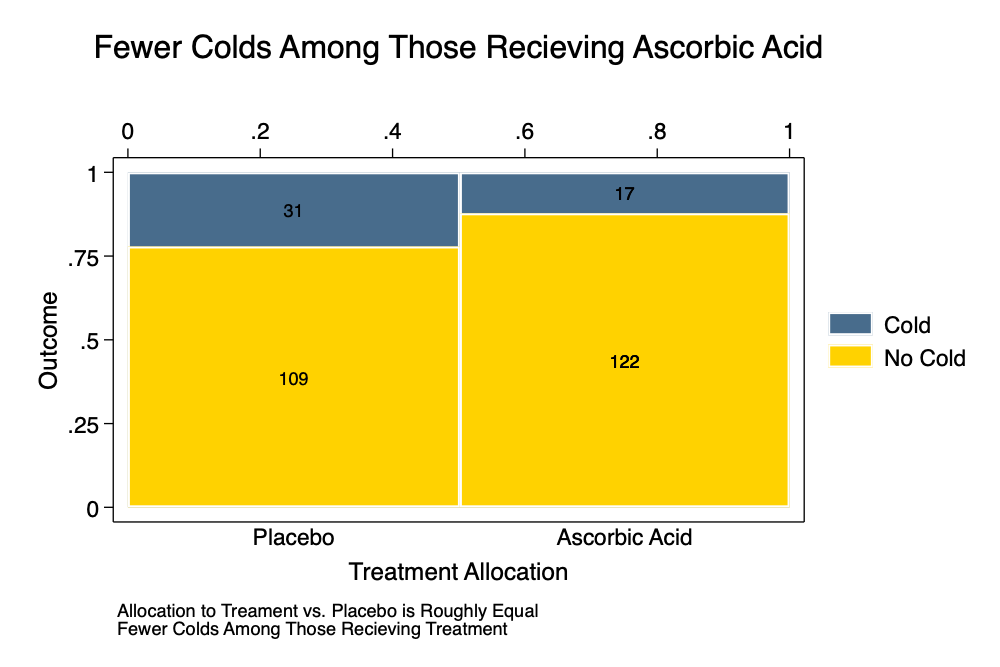

```{r setup, include=FALSE}

knitr::opts_chunk$set(echo = FALSE)

```

Visualizing categorical data--that that come in the form `1/0` or *yes vs. no*, can be a challenging task. I have put together some thoughts on visualizing categorical data, as part of my course on analyzing categorical data. The notes can be found [here](https://agrogan1.github.io/newstuff/categorical/visualizing-categorical-data/visualizing-categorical-data.html) [[PDF](https://agrogan1.github.io/newstuff/categorical/visualizing-categorical-data/visualizing-categorical-data.pdf)].


```{r}



```


