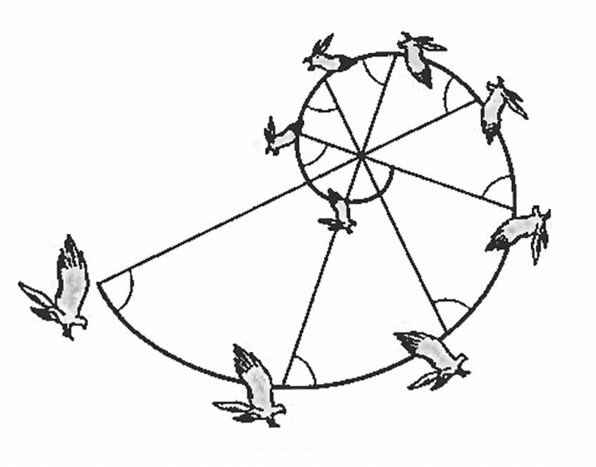

I've revised my introductory materials on logarithms.

* Here is a [version of these materials that makes connections to the logistic regression model](https://agrogan1.github.io/closeread/logarithms/logarithms.html) used in categorical data analysis.
* And here is a [simpler more straightforward version](https://agrogan1.github.io/closeread/logarithms/logarithms-simple.html).

::: {layout-ncol=3}

:::

