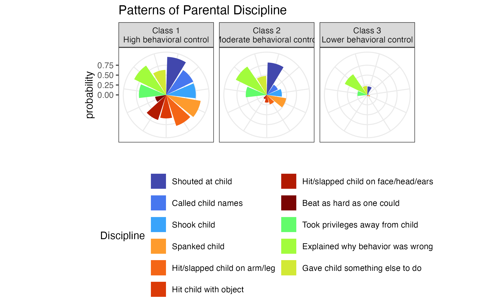

Several years ago, we published an article entitled "Patterns of Caregiver Aggressive & Nonaggressive Discipline Toward Young Children in Low- and Middle-Income Countries: A Latent Class Approach" [@Ward2022LCA]. I've mentioned that article [elsewhere on this site](https://agrogan1.github.io/posts/patterns/index.html).

I've recently developed a scrollytelling overview of that paper using closeread.  The scrollytelling version can be found here:  [https://agrogan1.github.io/closeread/patterns/patterns.html](https://agrogan1.github.io/closeread/patterns/patterns.html)

{width=50%}
    