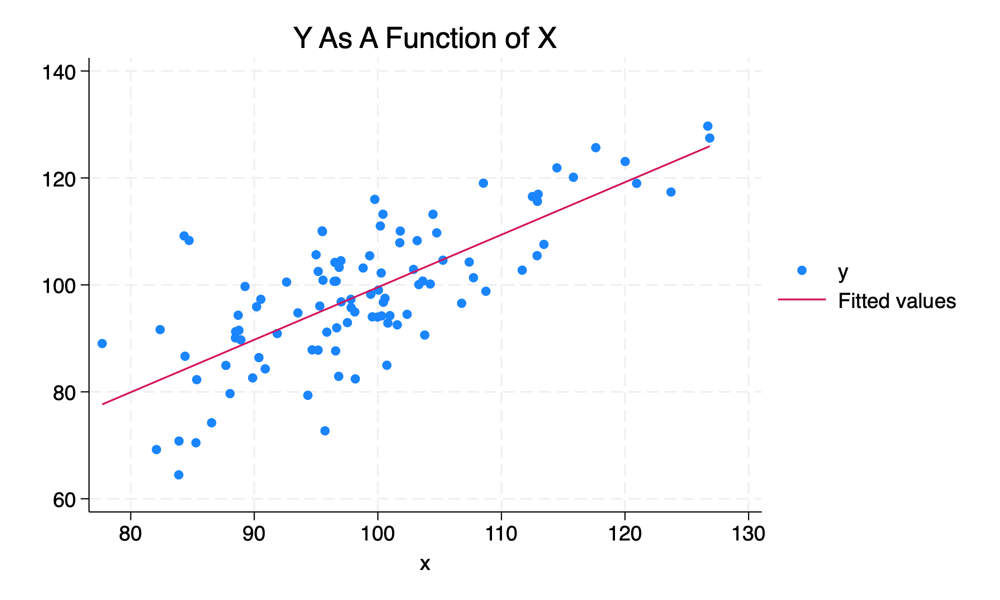

# Background

I'm sometimes asked for a quick outline of how to proceed with a multilevel analysis. Below are the steps that I would use in Stata, though they would be very conceptually similar in R.

```{r}

library(haven)

library(Statamarkdown)

```


# Get acquainted with your data

Figure out what variables correspond to what measures and constructs. e.g.: 

* `lookfor health`
*	`lookfor ses`
* `describe question37`

# Prepare and clean your data

Rename variables to be more intuitive.  e.g.:

`rename q21 health`
	
Recode missing values. e.g:

`recode health (99=.)`

Keep only necessary variables.

`keep age race sex ses health q21 neighborhood`

# Descriptive statistics

* `summarize continuousvars`
* `tab1 categoricalvars`

And in more recent versions of Stata

* `dtable continousvars i.categoricalvar1 i.categoricalvar2`

# Multilevel model

1. `mixed y || groupid: // unconditional model`
2. `estat icc`
3. `mixed y x1 x2 || groupid:`
4. `mixed y x1 x2 || groupid: x1 x2`

# Graph	

```{r}
#| column: margin
#| message: false

N <- 100

x <- rnorm(N, 100, 10)

e <- rnorm(N, 0, 10)

y <- x + e

mydata <- data.frame(x,y)

write_dta(mydata, "mydata.dta")

```

```{stata}
#| output: false

use mydata.dta

twoway (scatter y x) (lfit y x), title("Y As A Function of X")

graph export "mygraph.png", replace width(2000)

```




* `histogram y`

* `twoway scatter y x1`

* `spagplot y x1, id(groupid)`

