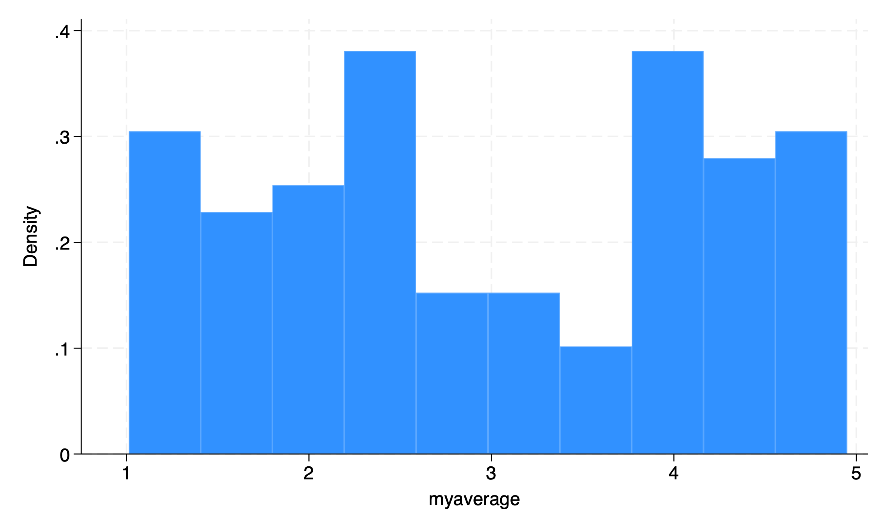
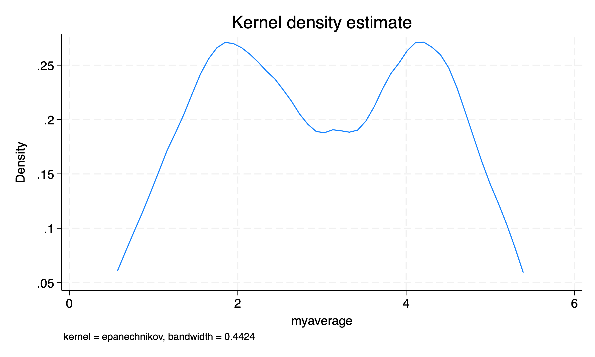
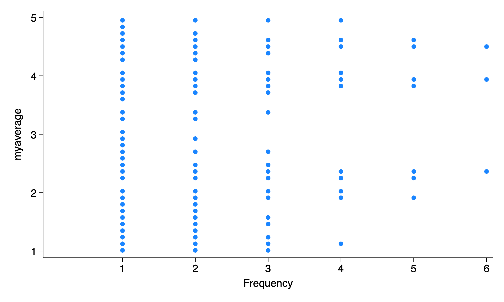
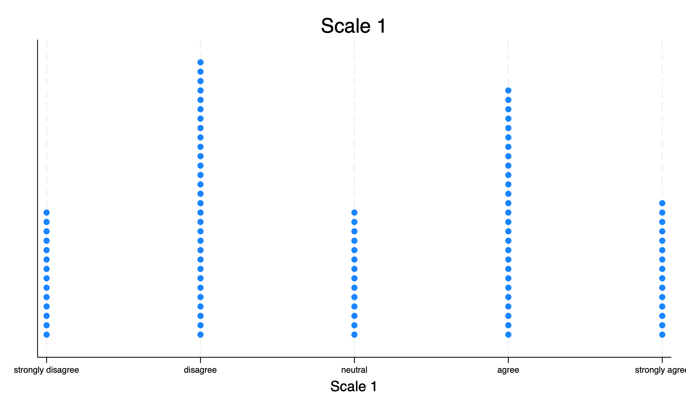

# Background

```{r}
#| echo: false
#| output: false

library(Statamarkdown)

```

For a recent project, we have been working with a lot of Likert scale data (e.g. "strongly disagree", "disagree", "neutral", "agree", "strongly agree"). Many times we are averaging several questionnaire items into a summary score e.g. `generate myaverage = (Q1 + Q2 + Q3)/3`.

I've been thinking about the best way to visualize these distributions of scale scores. Stata offers *histograms*, *kernel densities* and *dotplots*, none of which seem 100% intuitive or satisfactory. *dotplots* are intuitive in that every person is represented by a *dot*, but the fact that they are turned sideways in Stata seems unsatisfactory and counter-intuitive to me.

```{stata, collectcode=TRUE}
*| code-fold: true
*| code-summary: "Show the code"
*| echo: true
*| output: false

clear all // clear data

set obs 100 // 100 observations

generate myaverage = runiform(1, 5) // randomly simulated score

histogram myaverage

graph export "myhistogram.png", replace

kdensity myaverage

graph export "mydensity.png", replace

dotplot myaverage

graph export "mydotplot.png", replace

```

::: {layout-ncol=3}





:::

# `stripplot`

I've come to like `stripplot` [@stripplot] as a more intuitive alternative to the above plots. `stripplot` requires a few options to make the plot I want, but is very useful.

```{stata, collectcode=TRUE}
*| code-fold: true
*| code-summary: "Show the code"
*| echo: true
*| output: false

stripplot myaverage, ///
stack /// stack the dots
width(1) /// bin with width 1
msymbol(circle) /// symbols are circles
title("Scale 1") /// title
xtitle("Scale 1") /// title for x axis
xlabel(1 "strongly disagree" 2 "disagree" 3 "neutral" 4 "agree" 5 "strongly agree", labsize(vsmall)) // customize labels

graph export "mystripplot.png", replace

```

{width=50%}

# Adjusting the Bin Width

The width of the bins that `stripplot` uses can be changed with the `width()` option to adjust the *resolution* of the graph.

```{stata, collectcode=TRUE}
*| code-fold: true
*| code-summary: "Show the code"
*| echo: true
*| output: false

stripplot myaverage, stack width(.25) msymbol(circle)

graph export "mystripplotA.png", replace

stripplot myaverage, stack width(.5) msymbol(circle)

graph export "mystripplotB.png", replace

stripplot myaverage, stack width(1) msymbol(circle)

graph export "mystripplotC.png", replace

```

::: {layout-ncol=3}


:::


