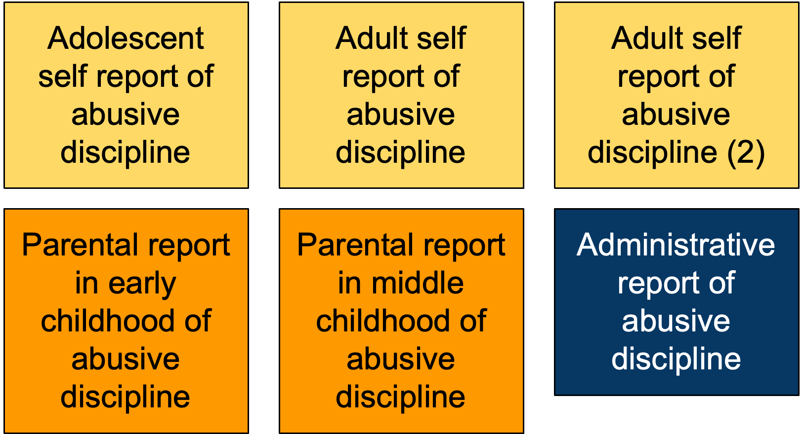

The measurement of child maltreatment has been a longstanding issue. Information about child maltreatment can come from multiple sources.

{width=33%}

There may be discrepancies across administrative records, parent-reports, and self-reports.

One proposed solution is “triangulation”, or integrating data from multiple reporters and sources.

However, it remains unclear how best to operationalize this concept.

In this study [@Eldeeb2026] We employ multiple advanced quantitative strategies to demonstrate how one might productively *triangulate* upon the measurement of child maltreatment. 

[https://agrogan1.github.io/closeread/triangulation/triangulation.html](https://agrogan1.github.io/closeread/triangulation/triangulation.html)

